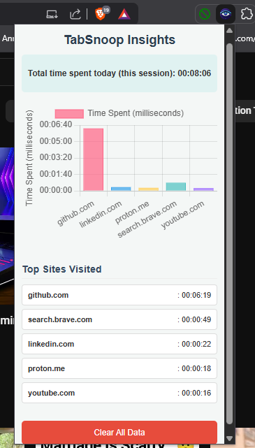

# TabSnoop: Your Personal Browser Tab Time Tracker

## Demo

<p align="center">
  
</p>

---

TabSnoop is a lightweight and privacy-focused Chrome extension designed to help users understand and manage their Browse habits by providing detailed insights into time spent on each unique website domain. It's an ideal tool for fostering digital wellness, identifying time sinks, and gaining a clearer picture of your online productivity.

## Features

- **Automatic Time Tracking**: Silently and accurately monitors active tab duration across different websites.
- **Domain-Based Aggregation**: Aggregates time spent on unique domains (e.g., `google.com`, `youtube.com`), providing a comprehensive view of total engagement.
- **Intuitive Dashboard**: A clean popup UI (accessible via the extension icon) presents a visual summary:
    - Dynamic chart (e.g., bar chart) illustrating time distribution across top domains.
    - Ranked list of top websites by total time spent, with precise durations.
    - Real-time daily summary of Browse activity.
- **Local & Private Data Storage**: All tracking data is stored securely in the browser's `chrome.storage.local`, ensuring user privacy and persistence across sessions.
- **Data Management**: Includes an option to clear all historical Browse data, allowing for a fresh start.
- **Offline Capable**: Functions entirely client-side, requiring no internet connection for core tracking functionality.
- **Export Functionality (Optional/Future)**: Ability to export raw usage data for custom analysis.

## Table of Contents

1. [About TabSnoop](#about-tabsnoop)
2. [Features](#features)
3. [Getting Started](#getting-started)
4. [How It Works](#how-it-works)
5. [Data & Privacy](#data--privacy)
6. [Contributing](#contributing)
7. [License](#license)

---

## About TabSnoop

This section provides a more detailed overview of the extension's purpose and benefits. It helps users quickly grasp what TabSnoop offers.

TabSnoop aims to provide transparency into your digital consumption. By offering clear data visualizations and easy data management, it empowers you to make informed decisions about your online time. Whether you're tracking productivity, managing distractions, or simply curious about your Browse patterns, TabSnoop offers a simple, unobtrusive solution.

## 🚀 Getting Started

### Installation (for Users)

1.  Download the latest release from the [Chrome Web Store](https://chrome.google.com/webstore/detail/tabsnoop/YOUR_EXTENSION_ID) (once published).
2.  Alternatively, load it as an unpacked extension:
    * Clone this repository or download the ZIP.
    * Open Chrome, navigate to `chrome://extensions`.
    * Enable **"Developer mode"**.
    * Click **"Load unpacked"** and select the `tabsnoop` project folder.

### Development Setup (for Contributors/Developers)

1.  **Clone the repository:**
    ```bash
    git clone [https://github.com/fraonar/TabSnoop.git](https://github.com/fraonar/TabSnoop.git)
    cd TabSnoop
    ```

2.  **Install Dependencies:**
    * This project is built with vanilla JavaScript, HTML, and CSS.
    * It uses `Chart.js` (included locally in `lib/chart.umd.js` to comply with Chrome's Content Security Policy). No `npm install` is typically required unless adding build tools.

3.  **Load as Unpacked Extension:** Follow the "Installation (for Users)" steps above.

4.  **Debugging:**
    * For `background.js` logs, click **"service worker"** on the `chrome://extensions` page.
    * For `popup.html`/`popup.js` logs, right-click the extension popup and select **"Inspect"**.

---

## How It Works

TabSnoop leverages Chrome's extension APIs to achieve its tracking functionality.

### Key Components:

* **`background.js`**:
    * Manages the core logic for tab activity monitoring.
    * Listens to `chrome.tabs.onActivated` and `chrome.tabs.onUpdated` events to detect active tab changes.
    * Uses `chrome.idle.onStateChanged` to pause tracking when the user is idle, ensuring accurate time measurement.
    * Persistently stores aggregated time data in `chrome.storage.local`.

* **`popup.html` & `popup.js`**:
    * The user interface (UI) that appears when the extension icon is clicked.
    * `popup.js` retrieves stored time data from `chrome.storage.local`.
    * Dynamically renders the time spent on each domain using `Chart.js` for visualizations and populates the ranked list.
    * Provides functionality for clearing all stored data.

* **`utils.js`**:
    * Contains helper functions, such as `formatTime` for converting seconds into a human-readable format.

---

## 🛡️ Data & Privacy

TabSnoop is designed with user privacy as a top priority.

* **Local Storage Only:** All Browse data is processed and stored **exclusively within your browser's local storage**.
* **No External Transmission:** No data is transmitted to external servers, collected by the extension developer, or shared with any third parties.
* **Complete Control:** You have full control over your data, including the option to clear all stored information at any time.

---

## 🤝 Contributing

Contributions are welcome! If you have ideas for features, bug fixes, or improvements, please follow these steps:

1.  Fork the repository.
2.  Create a new branch (`git checkout -b feature/your-feature-name`).
3.  Make your changes and commit them (`git commit -m 'feat: Add new awesome feature'`).
4.  Push to your branch (`git push origin feature/your-feature-name`).
5.  Open a Pull Request with a detailed description of your changes.

---

## 📄 License

This project is licensed under the [MIT License](LICENSE). See the `LICENSE` file for details.
